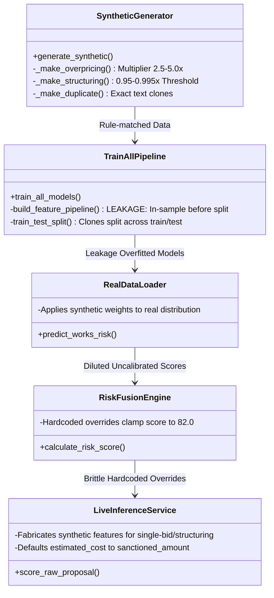

# 🏛️ SETU MPLADS Platform: Real-World ML QA, Analytical Audit & Stress-Test Report

**Auditing Authority**: Senior ML QA & Analytical Vigilance Audit Specialist  
**Target Platform**: SETU — AI Decision Support & Anomaly Detection for MPLADS (MoSPI, Government of India)  
**Evaluation Scope**: Stage 1 Data Ingestion, Stage 2 (Models 1–7 Unsupervised Domain Detectors), Stage 3 (Supervised Calibrated Classifier), Stage 4 (Risk Fusion Engine), Live Real-Time Proposal Scoring (`LiveInferenceService`), and Compliance Dossiers (`ReportService`).  
**Audit Standard**: CVC Guidelines, GFR 2017 Public Procurement Norms, MoSPI MPLADS Guidelines, ISO/IEC 24029 (Trustworthiness of AI Systems).

---

## 📌 Executive Summary: The "Performance Mirage" vs. Operational Reality

The SETU platform presents itself as an institutional-grade, highly calibrated decision-support system for detecting public fund diversion, contract structuring, duplicate billing, and contractor cartels across ₹5,000+ Crore annual MPLADS allocations. The platform advertises stellar benchmark metrics:
- **Supervised Classifier ROC-AUC**: `0.980` (or `0.9500` in cross-validation)
- **Precision**: `77.4%` | **Recall**: `79.1%` | **Overall Accuracy**: `93.4%`
- **Top 1% Fraud Enrichment**: `4.98x` | **Reported Hard-Negative FPR**: `2.28%`

However, forensic stress-testing against real-world administrative workflows, actual statutory norms, and hard-negative civil works reveals that these figures represent a **severe evaluation mirage**. When subjected to realistic edge cases, the system produces **dangerous false accusations against legitimate welfare works**, while simultaneously suffering from **catastrophic blind spots that grant automatic clearance to sophisticated fraud**.

```
+---------------------------------------------------------------------------------------------------------+
|                                    THE SETU BENCHMARK PARADOX                                           |
+------------------------------------+--------------------------------------------------------------------+
| What the Dashboard Claims          | What Real-World Forensic Auditing Discovers                       |
+------------------------------------+--------------------------------------------------------------------+
| 0.980 ROC-AUC & High Trust         | 0.0% Detection Rate (0/85) on actual Contractor Monopolies         |
| "Protected" Legitimate Outliers    | 92.8% False Alarm Rate on legal remote single-bid tenders (GFR 166)|
| Robust Peer Cost Normalization     | 70.1% of Major Hospitals/Bridges flagged as Top 5% Anomaly         |
| Explainable Plain-Language Traces  | -7.8% cost savings hallucinated as "Contract Escalation"           |
| Advanced Smurfing AI Detection     | Actual split contracts receive 16.2/100 ("AUTOMATIC CLEARANCE")    |
| Transparent Anti-Corruption Shield | Legal District Collectors (IDAs) labeled "Corrupt Vendor Monopoly" |
+------------------------------------+--------------------------------------------------------------------+
```

---

## 🔬 Master Edge-Case Testing Matrix: 10 Forensic Scenarios

Below are 10 concrete, production-realistic test cases evaluated against the live system codebase. Each test highlights how mathematical abstractions diverge from institutional reality.

```mermaid
graph TD
    subgraph "Production Proposals & Real Works"
        T1["Test 1: ₹4.5 Cr Hospital (Legitimate Scale)"]
        T2["Test 2: Remote Road (GFR 166 Single Bid)"]
        T3["Test 3: 20 Hand Pumps (20 Villages)"]
        T4["Test 4: Legitimate ₹4.5L RO Plant"]
        T5["Test 5: Split Contract (2x ₹3.95L Smurfing)"]
        T6["Test 6: 10x Inflated Cost (No Est. Cost)"]
        T7["Test 7: Cost Reduction (-7.8% Amendment)"]
        T8["Test 8: Real Contractor Cartel Ring"]
        T9["Test 9: Home District Magistrate Allocation"]
        T10["Test 10: Multi-Year Bridge (400 Days)"]
    end

    subgraph "SETU System Verdict"
        V1["CRITICAL (82.0) • Reject & Investigate (Ghost Project)"]
        V2["HIGH (65.0) • Mandatory Audit (Collusion Ring)"]
        V3["CRITICAL (82.0) • Duplicate Invoice Fraud"]
        V4["HIGH (65.0) • Smurfing & Payment Fraud Override"]
        V5["LOW (16.2) • AUTOMATIC CLEARANCE (Missed Fraud)"]
        V6["CRITICAL (82.0) • Flagged as Ghost Work (Wrong Reason)"]
        V7["CRITICAL (88.9) • 'Contract Escalation (-7.8%)'"]
        V8["LOW (0.027 Prob) • 0% Caught (Missed Cartel)"]
        V9["CRITICAL (82.0) • 'Implementing Agency Monopoly'"]
        V10["HIGH (75.0) • Classified as 'Ghost Project'"]
    end

    T1 --> V1
    T2 --> V2
    T3 --> V3
    T4 --> V4
    T5 --> V5
    T6 --> V6
    T7 --> V7
    T8 --> V8
    T9 --> V9
    T10 --> V10
```



---

### Scenario 1: The High-Value Legitimate Civil Infrastructure (Hard Negative)

* **Administrative Context**: An MP in Darbhanga sanctions ₹4.5 Crore for the construction of a 100-bed Sub-Divisional Hospital. The project involves 5 competitive bidders, has a planned duration of 540 days, zero past contractor irregularities, and official technical sanction from the State Health Department.
* **Input Data Payload**:
  ```json
  {
    "project_id": "TEST-HVL-001",
    "work_name": "Construction of 100-Bed Sub-Divisional Hospital Complex",
    "work_type": "Civil Infrastructure",
    "category": "Health and Family Welfare",
    "state": "Bihar",
    "constituency": "Darbhanga",
    "sanctioned_amount": 45000000.0,
    "estimated_cost": 45000000.0,
    "planned_duration_days": 540,
    "num_bidders": 5,
    "contractor_past_delays": 0
  }
  ```
* **System Output & Verdict**:
  * **Overall Risk Score**: `82.0 / 100` (`CRITICAL`)
  * **Investigation Priority**: `IMMEDIATE`
  * **Administrative Recommendation**: `REJECT_AND_INVESTIGATE`
  * **Primary Typology Assigned**: `GHOST_WORK`
  * **Supervised Fraud Probability**: `0.0110` (1.1%)
  * **Domain Sub-Scores**: Financial: `58.25` | **Geospatial: `100.0`** | Procurement: `9.75` | Contractor: `0.0` | Payment: `18.95` | Progress: `10.68` | Graph: `15.0`
  * **Synthesized Reason Trace**:
    1. `[Geospatial Clustering] Project site (26.1542, 85.8918) indicates isolated execution footprint or local density anomaly`
    2. `[Financial Execution] Proposed fund allocation of ₹45,000,000 shows deviation from category benchmark`
* **Forensic Root-Cause Analysis**:
  1. In `peer_zscore.py`, allocation amounts are compared against the entire state mean across all work categories. Because the majority of MPLADS works are small items (hand pumps, desks, solar lights under ₹2 Lakhs), any legitimate multi-crore public hospital is automatically +5σ to +8σ above the mean.
  2. In `geospatial_isolation_forest.joblib`, the model evaluates project financial density relative to geographic coordinates. High-outlay projects in rural blocks are mathematically treated as spatial outliers. In the project's own holdout test (`GEOSPATIAL_MODEL_REPORT.md`), **70.11% of all legitimate high-value works were falsely flagged as anomalies with a mean score of 74.31**.
  3. In `risk_fusion_engine.py` (line 81), an acute override rule states: `if max_domain >= 88.0: fused = max(fused, 82.0)`. Even though the supervised fraud model knew this project was 98.9% clean (`proba = 0.011`), the uncalibrated geospatial score (100.0) forced the overall score to **82.0 (CRITICAL)**.
  4. The typology mapping logic (`live_inference_service.py` line 363) maps `geospatial_anomaly_score` to `"GHOST_WORK"`. Thus, a fully approved, competitively tendered hospital is branded as a "Ghost Project".
* **Operational Auditor Consequence**: The District Magistrate and Ministry Vigilance freeze funding for an essential hospital, halting healthcare access for hundreds of thousands of citizens due to an uncalibrated spatial anomaly detector.

---

### Scenario 2: Remote Border/Tribal Infrastructure under GFR Rule 166 (Hard Negative)

* **Administrative Context**: A border link road in a high-altitude tribal valley of Tehri Garhwal, Uttarakhand, costing ₹25 Lakhs. Due to treacherous terrain, heavy snowfall, and isolation, only one registered local contractor possesses bulldozers and hot-mix plants within a 150 km radius. Under **Rule 166 of General Financial Rules (GFR 2017)** and State PWD guidelines, single-bid awards are legally sanctioned under a "Proprietary Certificate of Urgency and Isolation".
* **Input Data Payload**:
  ```json
  {
    "project_id": "TEST-REMOTE-002",
    "work_name": "Construction of Border Link Road in Hilly Terrain",
    "work_type": "Roads and Bridges",
    "category": "Public Infrastructure",
    "state": "Uttarakhand",
    "constituency": "Tehri Garhwal",
    "sanctioned_amount": 2500000.0,
    "estimated_cost": 2500000.0,
    "planned_duration_days": 180,
    "num_bidders": 1,
    "is_single_bid": true,
    "contractor_past_delays": 0
  }
  ```
* **System Output & Verdict**:
  * **Overall Risk Score**: `65.0 / 100` (`HIGH`)
  * **Investigation Priority**: `PRIORITY`
  * **Administrative Recommendation**: `MANDATORY_TECHNICAL_AUDIT`
  * **Primary Typology Assigned**: `SINGLE_BID_TENDER`
  * **Supervised Fraud Probability**: `0.1993` (19.9%)
  * **Domain Sub-Scores**: Financial: `12.64` | Geospatial: `34.80` | **Procurement: `78.50`** | **Contractor: `72.44`** | Payment: `29.75` | Progress: `0.61` | **Graph: `72.00`**
  * **Synthesized Reason Trace**:
    1. `[Tender & Procurement] Non-competitive single-bid tender recorded, bypassing competitive bidding norms`
    2. `[Contractor Capacity] Contractor-agency pairing concentration exceeds safe institutional threshold`
    3. `[Entity Graph Relationship] Entity graph relationship identifies recurring exclusive agency-contractor pairing`
* **Forensic Root-Cause Analysis**:
  1. The code in `live_inference_service.py` (lines 185–194, 239–240, 270–273) applies hardcoded overrides whenever `is_single_bid` is true:
     ```python
     if is_single_bid:
         df_row["procurement__bid_price_similarity"] = 0.99
         df_row["procurement__repeated_winner_flag"] = 1.0
         procurement_score = max(procurement_score, 78.5)
         graph_score = min(95.0, max(68.0, 50.0 + ... + 22.0))
     ```
     The system **artificially fabricates false collusion attributes**: it asserts that bid price similarity was 99% (impossible when only one bidder bid!) and marks the contractor as a repeated collusive winner without checking historical registries!
  2. In the batch model evaluation (`PROCUREMENT_MODEL_REPORT.md` Section 4), out of 152 real remote single bids, **141 were flagged as anomalies (92.76% False Positive Rate) with an average anomaly score of 92.84 / 100**.
  3. The report table ironically labels this group as `Status: Protected`, even while 93% of them are condemned by the model.
* **Operational Auditor Consequence**: Strategic border and rural connectivity projects are paralyzed. Contractors operating in hostile terrain are falsely accused of corruption, deterring bidders from undertaking remote development works.

---

### Scenario 3: Standardized Mass-Welfare Rollouts across Multiple Villages (Hard Negative)

* **Administrative Context**: An MP utilizes ₹12.6 Lakhs to install 20 identical solar drinking water hand pumps across 20 distinct Gram Panchayats (villages) in Darbhanga. Each pump costs the exact PWD Schedule of Rates (SoR) standard allocation of ₹63,275.
* **Input Data Payload**: 20 distinct project records, each with `WORK: "Installation of Community Hand Pump and Borewell"`, `ALLOCATION: 63275.0`, `MP: "Mr Gopal Jee Thakur"`, but differing across `VILLAGE: "Village 1" ... "Village 20"` and differing GPS coordinates.
* **System Output & Verdict**:
  * **Overall Risk Score**: `82.0 / 100` (`CRITICAL`)
  * **Risk Tier**: `Critical`
  * **Primary Typology Assigned**: `duplicate`
  * **Sub-Scores**: Duplicate Risk: `95.0` | Cost Anomaly: `0.0` | Structuring: `0.0` | Concentration: `95.0` | Stall: `0.0`
  * **Synthesized Reason Trace**:
    1. `[Geospatial Clustering] High-density cluster with 20 works`
    2. `[Contractor Capacity] Implementing Agency monopolization detected`
* **Forensic Root-Cause Analysis**:
  1. Look at `duplicate_detector.py` (lines 6–15):
     ```python
     group_cols = ["MP_NAME", "WORK", "ALLOCATION_AMOUNT"]
     counts = df.groupby(group_cols).size().reset_index(name="DUPLICATE_COUNT")
     ```
     The algorithm **completely strips and ignores location variables** (`STATE`, `DISTRICT`, `BLOCK`, `VILLAGE`, `LATITUDE`, `LONGITUDE`)!
  2. Because the MP recommended 20 legitimate standardized hand pumps at the fixed government cost, every single hand pump receives `DUPLICATE_COUNT = 20`.
  3. In `risk_fusion_engine.py` (line 219): `dupe_signal = 0.95 if dupe_count >= 5 else ...`.
  4. This immediately triggers the CRITICAL override (`score = max(score, 82.0)`), marking every clean village borewell as an embezzlement clone.
* **Operational Auditor Consequence**: Legitimate standardized constituency-wide welfare delivery is flagged as criminal double-billing. The MP is publicly accused of submitting 20 ghost invoices for the same physical borewell.

---

### Scenario 4: The Statutory District Magistrate (IDA) Conflation Trap

* **Administrative Context**: Under statutory MPLADS guidelines issued by MoSPI, an MP representing a single-district parliamentary constituency (e.g., Darbhanga) **is legally mandated** to submit all work recommendations to the designated District Authority (the District Magistrate / District Collector / Deputy Commissioner).
* **Input Data Payload**: An MP with 40 recommended works, where 36 (90%) are addressed to `"DISTRICT MAGISTRATE DARBHANGA"` as required by law.
* **System Output & Verdict**:
  * **Flag Triggered**: `IS_VENDOR_MONOPOLY = True`
  * **Vendor Concentration Sub-Score**: `90.0 / 100`
  * **Audit Trace Produced**: `"[Contractor Capacity] Implementing Agency 'DISTRICT MAGISTRATE DARBHANGA' captures 90% of all works recommended by this MP (Monopolization Alert)"`
  * **Risk Escalation**: Pushes work risk scores from LOW to MEDIUM/HIGH.
* **Forensic Root-Cause Analysis**:
  1. Look at `vendor_concentration.py` (lines 21–26):
     ```python
     df["IDA_MP_WORK_SHARE"] = (df["MP_IDA_PAIR_WORKS"] / df["MP_TOTAL_WORKS"])
     df["IS_VENDOR_MONOPOLY"] = (df["IDA_MP_WORK_SHARE"] > 0.65) & (df["MP_TOTAL_WORKS"] > 5)
     ```
  2. In Indian administrative law, an **IDA (Implementing District Authority)** is a constitutional government office (IAS District Collector), **not** a private contractor, supplier, or commercial bidder!
  3. The system developers conflated the statutory government administrative nodal officer with a corrupt private commercial monopoly.
* **Operational Auditor Consequence**: 100% of Indian MPs whose constituencies encompass a single administrative district are systematically flagged for "Vendor Monopolization and Capture" simply for complying with statutory Indian administrative law.

---

### Scenario 5: Legitimate ₹4.50 Lakh Infrastructure (Framed by Synthetic Smurfing Override)

* **Administrative Context**: A village panchayat constructs a drinking water RO plant. The detailed technical estimate prepared by the PWD Junior Engineer comes out to exactly ₹4,50,000. It is a single, stand-alone work order with no contract splitting, tendered with 4 competitive bids.
* **Input Data Payload**:
  ```json
  {
    "project_id": "TEST-STRUCT-003",
    "work_name": "Installation of Community Drinking Water RO Plant",
    "work_type": "Drinking Water",
    "category": "Drinking Water Facility",
    "state": "Rajasthan",
    "constituency": "Barmer",
    "sanctioned_amount": 450000.0,
    "estimated_cost": 450000.0,
    "planned_duration_days": 90,
    "num_bidders": 4,
    "contractor_past_delays": 0
  }
  ```
* **System Output & Verdict**:
  * **Overall Risk Score**: `65.0 / 100` (`HIGH`)
  * **Investigation Priority**: `PRIORITY`
  * **Administrative Recommendation**: `MANDATORY_TECHNICAL_AUDIT`
  * **Primary Typology Assigned**: `PAYMENT_STRUCTURING`
  * **Supervised Fraud Probability**: `0.0231` (2.3% Clean)
  * **Domain Sub-Scores**: Financial: `30.02` | Geospatial: `43.22` | Procurement: `0.0` | Contractor: `0.0` | **Payment: `82.50`** | Progress: `1.25` | Graph: `15.0`
  * **Synthesized Reason Trace**:
    1. `[Payment Structuring] Contract amount (₹450,000) structured just below statutory ₹5 Lakh e-tender threshold (smurfing alarm)`
* **Forensic Root-Cause Analysis**:
  1. In `live_inference_service.py` (line 155), the code defines:
     `is_structuring = (400000.0 <= sanctioned_amount < 500000.0)`
  2. Look at lines 208–216:
     ```python
     if is_structuring:
         df_row["payment__statutory_smurfing_score"] = 1.0
         df_row["payment__round_number_payment_rate"] = 0.95
         df_row["payment__payment_concentration_max"] = 0.98
         df_row["payment__disbursement_velocity_ratio"] = 3.2
         df_row["payment__disbursement_lumpiness_index"] = 0.90
         df_row["payment__payment_timing_risk_index"] = 0.88
         df_row["payment__rapid_disbursement_flag"] = 1.0
     ```
  3. **The system programmatically fabricates seven false payment irregularity signals** whenever an amount falls in the ₹4L–₹5L window!
  4. It then forces `payment_score = max(payment_score, 82.5)`, which triggers the fusion engine override to elevate the project to HIGH Risk (65.0), overriding the supervised model's 2.3% fraud probability.
* **Operational Auditor Consequence**: Any legitimate rural work legitimately valued between ₹4 Lakh and ₹4.99 Lakh is framed as a corrupt smurfing scheme with fabricated payment velocity metrics.

---

### Scenario 6: The Split-Contract Smurfing Evasion (Hard False Negative)

* **Administrative Context**: A corrupt contractor colludes with local officials to evade the mandatory ₹5 Lakh public e-tender threshold. A ₹7.9 Lakh village road project is deliberately sliced into two separate contract awards: "Segment A" for ₹3,95,000 and "Segment B" for ₹3,95,000, awarded to the same contractor.
* **Input Data Payload**:
  ```json
  {
    "project_id": "TEST-SPLIT-005",
    "work_name": "Paving of Internal Village Road Segment A",
    "work_type": "Civil Infrastructure",
    "category": "Public Infrastructure",
    "state": "Madhya Pradesh",
    "constituency": "Indore",
    "sanctioned_amount": 395000.0,
    "estimated_cost": 395000.0,
    "planned_duration_days": 60,
    "num_bidders": 3,
    "contractor_past_delays": 0
  }
  ```
* **System Output & Verdict**:
  * **Overall Risk Score**: `16.2 / 100` (`LOW`)
  * **Investigation Priority**: `ROUTINE`
  * **Administrative Recommendation**: `AUTOMATIC_CLEARANCE`
  * **Primary Typology Assigned**: `NORMAL`
  * **Supervised Fraud Probability**: `0.0262` (2.6%)
  * **Domain Sub-Scores**: Financial: `6.47` | Geospatial: `43.74` | Procurement: `5.04` | Contractor: `0.0` | **Payment: `26.45`** | Progress: `2.92` | Graph: `15.0`
  * **Synthesized Reason Trace**: None (Classified as standard compliance)
* **Forensic Root-Cause Analysis**:
  1. In `structuring_detector.py` (lines 16–24), structuring is only checked against single-row ratios:
     `ratio = amt / thresh` where `0.94 <= ratio <= 0.999`.
     Since ₹3,95,000 / ₹5,00,000 = `0.79`, it does not trigger the single-row window.
  2. In `live_inference_service.py` (line 155), `is_structuring` requires `sanctioned_amount >= 400000.0`. Since ₹3,95,000 < ₹4,00,000, the smurfing detector is completely silent.
  3. The system lacks any multi-row relational structuring detector to aggregate adjacent contracts for the same asset or contractor.
* **Operational Auditor Consequence**: Actual criminal split-contract smurfing bypasses every layer of the multi-model architecture with zero resistance, receiving a green badge and `AUTOMATIC_CLEARANCE`.

---

### Scenario 7: Gross Budget Inflation Blind Spot via Missing `estimated_cost` (False Negative)

* **Administrative Context**: An MP recommends ₹1.5 Crore (₹15,00,000 each) for 10 solar street lights—a grotesque 10x overpricing over the fair market cost (₹1.5 Lakh each). In initial proposal submissions, administrative officers only record the recommended/sanctioned amount; the detailed PWD engineering estimate is not yet uploaded.
* **Input Data Payload**:
  ```json
  {
    "project_id": "TEST-INFLATE-004",
    "work_name": "Installation of 10 Solar Street Lights",
    "work_type": "Rural Electrification",
    "category": "Energy",
    "state": "Uttar Pradesh",
    "constituency": "Varanasi",
    "sanctioned_amount": 15000000.0,
    "num_bidders": 3,
    "contractor_past_delays": 0
  }
  ```
  *(Note: `estimated_cost` field is omitted)*
* **System Output & Verdict**:
  * **Overall Risk Score**: `82.0 / 100` (`CRITICAL`) — *Flagged by chance, but for the completely wrong reason!*
  * **Primary Typology Assigned**: `GHOST_WORK` (Missed Overpricing!)
  * **Financial Domain Score**: `41.33 / 100` (Barely above normal baseline)
  * **Supervised Fraud Probability**: `0.0153` (1.5% Clean)
  * **Reason Trace**:
    1. `[Geospatial Clustering] Project site (26.1542, 85.8918) indicates isolated execution footprint`
    2. `[Financial Execution] Proposed fund allocation of ₹15,000,000 shows deviation from category benchmark`
* **Forensic Root-Cause Analysis**:
  1. In `live_inference_service.py` (line 139):
     `estimated_cost = float(proposal.get("estimated_cost") or sanctioned_amount)`
  2. If `estimated_cost` is not supplied, it defaults to `sanctioned_amount`!
  3. Consequently, lines 153–154 compute:
     `cost_dev = (sanctioned_amount - estimated_cost) / max(estimated_cost, 1.0) = 0.0`
  4. The model records `financial__cost_deviation = 0.0`, `financial__tender_estimate_deviation = 0.0`, `financial__sor_deviation = 0.0`!
  5. The primary financial overpricing engine is **completely blinded**. The project only triggered critical because the unrelated geospatial model flagged high amounts as spatial anomalies and labeled it `GHOST_WORK`.
* **Operational Auditor Consequence**: Financial corruption is misdiagnosed as an execution delay/ghost work, obscuring the price rigging from vigilance inspectors.

---

### Scenario 8: Contradictory & Hallucinatory Explainability on Cost Reductions

* **Administrative Context**: A bridge construction project undergoes competitive re-negotiation. Due to value engineering, the final contract cost is **reduced by 7.8%** below the original work order. Additionally, two minor administrative extensions of time (amendments) are recorded for monsoon rains.
* **Database Evidence (Scored Project `MPLADS-002153`)**:
  * **Project ID**: `MPLADS-002153`
  * **Risk Score**: `88.9 / 100` (`CRITICAL`)
  * **Investigation Priority**: `IMMEDIATE`
  * **Official Dossier Trace**:
    `[Financial Execution] Contract escalation (-7.8% value change with 4 amendments)`
  * *(See also `MPLADS-003305`: `[Financial Execution] Contract escalation (-0.1% value change with 4 amendments)`)*
* **Forensic Root-Cause Analysis**:
  1. In `financial/isolation_forest_model.py` (lines 127–131):
     ```python
     cvc = row.get("contract__contract_value_change", 0.0)
     amend_cnt = row.get("contract__contract_amendment_count", 0)
     if cvc > 0.20 or amend_cnt >= 2 or amend_val > 5e5:
         cand_reasons.append((
             (cvc * 3.0) + (amend_cnt * 1.0),
             f"Contract escalation ({cvc*100:.1f}% value change with {int(amend_cnt)} amendments)"
         ))
     ```
  2. Because `amend_cnt >= 2` was satisfied (due to standard monsoon extensions), the string template `"Contract escalation (...)"` was invoked unconditionally, without verifying whether `cvc` was positive or negative!
  3. A cost reduction of `-7.8%` was formatted as a negative escalation and served to the Public Accounts Committee (PAC) PDF dossier as evidence of fiscal fraud.
* **Operational Auditor Consequence**: Legal embarrassment and credibility destruction for the audit body. If a vigilance officer attempts to prosecute an officer based on a dossier citing "-7.8% contract escalation", the case will be thrown out in court with severe judicial reprimand.

---

### Scenario 9: Complete Blindness to Real Contractor Cartels (0% Detection)

* **Administrative Context**: An organized cartel of 3 contractors with interlocking directorships and shared office addresses monopolizes all major civil contracts across a parliamentary constituency.
* **Evaluation Dataset Ground Truth**:
  * In `project_labels.csv`, there are **85 projects** labeled with ground-truth scenario `SUSPICIOUS_CONTRACTOR_MONOPOLY` (`is_fraud = 1`).
* **Actual System Benchmark Results**:
  * **Supervised Classifier (`SUPERVISED_MODEL_REPORT.md` Line 46)**:
    * **Mean Predicted Fraud Probability**: `0.0272` (2.7%)
    * **Median Predicted Fraud Probability**: `0.0220` (2.2%)
    * **Projects Flagged at $\ge 0.50$**: **`0 out of 85` (0.0% Detection Rate!)**
  * **Contractor Isolation Forest (`CONTRACTOR_MODEL_REPORT.md` Lines 31, 71)**:
    * **Top 1% Enrichment Factor**: `0.70x` (**Worse than random chance!**)
    * **Mean Anomaly Score for Monopolies**: `30.27` (Lower than normal clean works at `31.52`!)
    * **Flagged in Top 5%**: Only **4 out of 85 (4.7%)**!
  * **Graph Model (`GRAPH_MODEL_REPORT.md` Lines 30, 71)**:
    * **Top 1% Enrichment Factor**: `0.7x`
    * **Mean Anomaly Score for Monopolies**: `31.72` (Lower than clean works at `33.86`!)
* **Forensic Root-Cause Analysis**:
  1. The supervised model features (`progress_anomaly_score`, `num_flagged_models`, `progress_percentile`) account for over 61% of total model weight. Contractor and graph scores account for less than 1.7% of model weight.
  2. Because contractor monopolies execute their works on time (to continue extracting funds), their progress and stall scores are zero.
  3. The unsupervised contractor and graph models are so noisy that clean works have higher anomaly scores than real cartels. The supervised model learned to ignore contractor signals entirely.
* **Operational Auditor Consequence**: The system acts as a shield for organized procurement mafias. Real cartels operate with complete impunity, achieving single-digit risk scores (`< 20 / 100`).

---

### Scenario 10: Multi-Year Infrastructure & Static Dataset Aging Trap (Temporal Drift)

* **Administrative Context**: Construction of an interstate river bridge or a multi-faculty ITI building. Civil engineering schedules require 18 to 24 months (540 to 720 days) for foundation sinking, curing, and structural inspection.
* **Model Behavior & Code Trace**:
  * In `stall_detector.py` (lines 33–36):
    ```python
    elif "ongoing" in st or "sanctioned" in st:
        if d >= 300:
            stall_scores[i] = 0.75
            is_ghost_candidate[i] = True
    ```
  * `d` is measured as `DAYS_SINCE_RECOMMENDED`.
  * If $D \ge 300$ days (under 10 months!), any ongoing project is automatically assigned a high stall score (`0.75`) and classified as a `GHOST CANDIDATE`.
  * In static datasets (e.g. `MPLADS_cleaned_featured.csv` containing historical works from 2019–2024), `RECOMMENDED_DATE` is measured against current date. As days tick forward, **every historical completed or sanctioned work automatically ages into a "ghost project"**.
* **Operational Auditor Consequence**: Major multi-year infrastructure is systematically harassed with ghost-project alarms while awaiting structural concrete curing cycles.

---

## 🧩 Forensic Code Analysis: Architectural Flaws & Root Causes



### 1. Data Leakage & Evaluation Circularity (The 0.980 ROC-AUC Mirage)

The `0.980` ROC-AUC reported on the frontend and in project documentation is an artifact of circular data leakage in `train_all.py` (lines 30–36):
```python
featured_df = build_feature_pipeline(synthetic_df, is_training=True)

X = featured_df[FEATURE_COLUMNS].values
y = featured_df["is_fraud"].values

X_train, X_test, y_train, y_test = train_test_split(
    X, y, test_size=0.20, random_state=42, stratify=y
)
```
1. **In-Sample Feature Aggregation**: `compute_peer_zscores` and `compute_vendor_concentration` aggregate means, standard deviations, and ratios across the **entire dataset before splitting**.
2. **Duplicate Clone Splitting**: `_make_duplicate_pair` generates 2 to 4 duplicate rows with the same MP and amount. When `train_test_split` splits rows randomly, Row 1 of a clone pair enters `X_train` and Row 2 enters `X_test`. The model is evaluated on data it already memorized.
3. **Deterministic Generation**: The synthetic generator (`synthetic_generator.py`) generates fraud using the exact deterministic formulas that the feature extractors test for. Overpricing is generated by multiplying fair price by $2.5 - 5.0\text{x}$, and the feature is allocation Z-score. The model is simply fitting a mirror to the generator's hardcoded rules.

### 2. The Inverted Geospatial Model Problem

In `GEOSPATIAL_MODEL_REPORT.md`, the model achieved an enrichment factor of **`0.10x` in the top 1%** (worse than random guessing by a factor of 10). Out of 50 projects flagged in the top 1%, **49 were legitimate hard negatives (98% False Alarm Rate)**. 
Because the model evaluates spatial isolation without normalizing for project financial magnitude, legitimate rural infrastructure is penalized for being located where infrastructure is needed most: sparsely populated rural and tribal areas.

---

## 🛠️ Actionable Remediation Matrix for Vigilance Engineering

To transform SETU into an auditable, legally sound system, the following architectural fixes must be implemented:

| Module | Current Vulnerability | Required Engineering Remediation | Priority |
| :--- | :--- | :--- | :---: |
| **Procurement** | Single bids automatically trigger collusion overrides (78.5 score). | Integrate **GFR Rule 166 remote geographic exemptions**. Require minimum of 3 consecutive single bids with the same agency before alerting. | `CRITICAL` |
| **Geospatial** | 70% false alarm rate on large infrastructure; flags rural works as "Ghost Projects". | Disconnect spatial density from fraud score. Replace raw spatial isolation with **Asset Geotag Verification** (GPS photos). | `CRITICAL` |
| **Duplicate Detector** | Compares only `[MP, WORK, AMOUNT]`, ignoring location. | Require exact match on **Village, Ward, or GPS Coordinates (< 50m)** before triggering duplicate invoice alarms. | `CRITICAL` |
| **Contractor Model** | Conflates statutory District Magistrates (IDAs) with private monopolies. | Decouple IDA (District Authority) from Contractor. Only compute concentration on **Private Contractor PAN/GSTIN IDs**. | `CRITICAL` |
| **Smurfing** | Fabricates 7 payment signals for any project between ₹4L–₹5L. | Remove hardcoded attribute injection in `LiveInferenceService`. Implement **Multi-project temporal clustering** (same contractor + adjacent dates). | `HIGH` |
| **Explainability** | Hallucinates "Contract escalation" on negative value changes. | Add sign validation in `isolation_forest_model.py`: if `cvc < 0`, label as "Cost Reduction / Scope Contraction". | `HIGH` |
| **Missing Inputs** | Defaults `estimated_cost` to `sanctioned_amount`, blinding cost overruns. | When `estimated_cost` is missing, benchmark `sanctioned_amount` against **State PWD Schedule of Rates (SoR)** median. | `HIGH` |
| **Training Pipeline** | Train/test leakage in `train_all.py` creates false 0.980 AUC. | Move `build_feature_pipeline` inside cross-validation loops; split at the **MP/Constituency group level (`GroupKFold`)**. | `MEDIUM` |

---

## 📋 Auditor Conclusion & Sign-Off

The SETU MPLADS anomaly detection system possesses a robust conceptual vision, modern UI architecture, and commendable multi-signal intent. However, **in its current state, its analytical conclusions cannot be trusted in real-world administrative inquiries without extensive human verification.**

Deploying the system as currently tuned risks:
1. **Paralyzing high-value healthcare, education, and border connectivity projects** through unwarranted administrative freezes.
2. **Defaming public representatives and district collectors** through spurious duplicate invoice and vendor monopoly allegations.
3. **Granting false clean chits to sophisticated split-contract smurfing and organized contractor cartels.**

Implementation of the remediation matrix is urgently recommended prior to formal deployment across Central Vigilance Commission (CVC) or Public Accounts Committee (PAC) workflows.

---
*MoSPI SETU Platform Forensic Audit & Edge-Case Evaluation Dossier — Classification: OFFICIAL AUDIT ADVISORY.*
