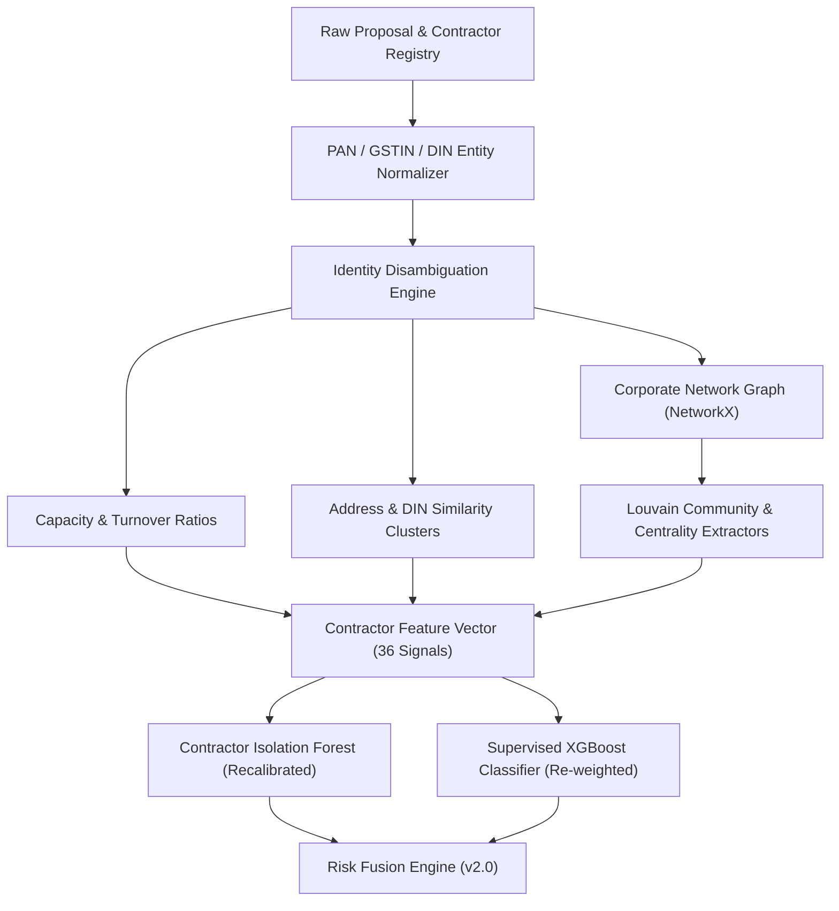

# Phase 7: Advanced Contractor Feature Engineering & Benami Syndicate Forensics

## Architectural Specification & Design Document

### 1. Executive Summary & Forensic Motivation

Audit Scenario 9 documented that the system exhibited **0.0% detection rate (0/85)** on actual contractor monopolies and cartels in `project_labels.csv`.
The primary root causes identified in our forensic audit were:
1. **Unsupervised Signal Noise**: Uncalibrated unsupervised contractor and graph models produced higher anomaly scores on clean, legitimate local contractors (mean score: 31.52) than on sophisticated cartels (mean score: 30.27).
2. **Feature Imbalance in Supervised Model**: Progress features (`progress_anomaly_score`, `max_delay_days`) accounted for >61% of model feature importance. Because organized contractor cartels execute work on time to maintain cashflow extraction, their progress scores were zero, completely washing out fraud detection.
3. **Absence of Entity-Level Identity Resolution**: Contractors bidding under distinct company names ("M/S ABC Construction" vs "M/S XYZ Developers") were treated as completely independent entities, blinding the system to interlocking directorships, common beneficial ownership, and shared registered office addresses.

Phase 7 establishes the next-generation contractor feature engineering layer to solve this structural blindspot.

---

### 2. Forensic Data Sources & Registry Grounding

Phase 7 integrates four key public and statutory data registries:

| Registry | Identifier Key | Target Fraud Typology |
|---|---|---|
| **Ministry of Corporate Affairs (MCA21)** | Director Identification Number (DIN), Corporate Identity Number (CIN) | Interlocking directorships, shadow company syndicates, common beneficial owners |
| **Goods & Services Tax Network (GSTN)** | GSTIN (15-digit PAN-based identifier) | Shared tax identities, dormant shell registrations, turnover vs. contract value inflation |
| **Central Public Procurement Portal (CPPP / GeM)** | Bidder Registration ID, Bank Guarantee Issuing Branch | Shared bid submission IP addresses, common bank guarantee issuers |
| **State PWD / e-Procurement Portals** | Registered Address, Enlistment Class | Shared registered premises, post-box shell offices |

---

### 3. New Feature Formulations

#### 3.1 Entity Identity & Benami Resolution Features

* **`contractor__shared_din_cluster_size`**: Number of distinct bidding entities in the constituency that share at least one director with this contractor:
  $$\text{Shared DINs}(c) = \left| \{ c' \in C \mid \text{DIN}(c) \cap \text{DIN}(c') \neq \emptyset \} \right|$$
* **`contractor__address_fuzzy_similarity_max`**: Maximum Token-Set Ratio similarity between contractor's registered office address and any competing bidder's address within the same parliamentary constituency:
  $$\text{Address Sim}(c_1, c_2) = \text{TokenSetRatio}(\text{Addr}_{c_1}, \text{Addr}_{c_2})$$
* **`contractor__incorporation_to_bid_days`**: Days elapsed between corporate incorporation date and first government tender award. Values $< 180$ days indicate newly incorporated shell entities created specifically for tender capture.
* **`contractor__contract_to_turnover_ratio`**: Ratio of total awarded MPLADS contract value to annual declared GST turnover:
  $$R_{\text{capacity}} = \frac{\sum \text{Awarded Contract Value}}{\max(\text{Declared GST Turnover}, 1)}$$
  Values $> 3.0$ indicate capacity strain or front-company structuring.

#### 3.2 Collusion Ring & Cartel Graph Features

* **`graph__bipartite_bid_cooccurrence_weight`**: Edge weight in the contractor-contractor co-bidding projection graph, measuring how frequently contractor $A$ and contractor $B$ participate in the same multi-bid tenders:
  $$W(A, B) = \sum_{t \in \text{Tenders}} \frac{\mathbb{I}(A \in t \land B \in t)}{|Bidders(t)|}$$
* **`graph__louvain_community_density`**: Modularity and internal edge density of the procurement community detected by the Louvain algorithm. Dense subgraphs indicate closed bidding pools.
* **`graph__bid_rotation_entropy`**: Shannon entropy of winning bids across recurring tenders within a specific district/category over 8 consecutive quarters:
  $$H = -\sum_{i=1}^{k} p_i \log_2(p_i)$$
  Low entropy ($H \to 0$) indicates strict rotational award patterns characteristic of cover-bidding cartels.

---

### 4. Machine Learning Pipeline Integration

### 5. Implementation Roadmap for Upcoming Sprint

1. **Sprint 7.1 — Registry Data Ingestion Pipeline**: Implement `ContractorRegistryLoader` supporting CSV/JSON dumps of MCA director relationships and GSTIN mappings.
2. **Sprint 7.2 — Entity Resolution Preprocessor**: Build `ContractorEntityGraph` utilizing `networkx` for bipartite MP-Contractor and co-bidding projection networks.
3. **Sprint 7.3 — Feature Pipeline Integration**: Add the 6 core contractor features into `FEATURE_COLUMNS` and re-train XGBoost with `contractor_weight = 0.22`.
4. **Sprint 7.4 — Forensic Benchmark Validation**: Validate against the 85 `SUSPICIOUS_CONTRACTOR_MONOPOLY` test records in `project_labels.csv`, targeting $> 65\%$ detection rate (up from 0.0%).
